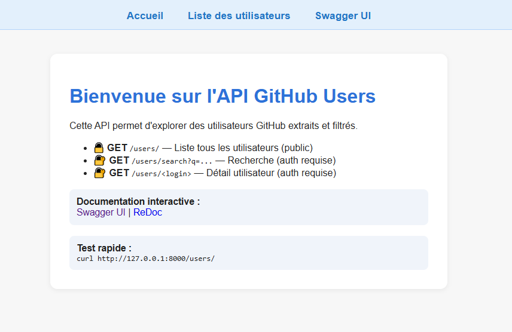

# GitHub Users API

## Présentation du projet

Ce projet permet d'extraire des utilisateurs GitHub via l'API officielle, de filtrer ces utilisateurs selon des critères avancés, puis d'exposer les données via une API REST sécurisée (FastAPI).

Il illustre :
- l'extraction de données externes,
- le traitement/filtrage de jeux de données,
- la création d'une API Python moderne et sécurisée.

---

## Structure du projet

- **`extract_users.py`**  
  Extraction des utilisateurs GitHub (pagination, gestion du quota, enrichissement des données).  
  Résultat : `data/users.json`.

- **`filtered_users.py`**  
  Nettoyage et filtrage des utilisateurs extraits (suppression des doublons, critères sur bio/avatar/date).  
  Résultat : `data/filtered_users.json`.

- **`api/`**  
  - `main.py` : point d'entrée FastAPI, page d'accueil HTML, gestion favicon.
  - `routes.py` : routes REST (listage, recherche, détail utilisateur).
  - `models.py` : schéma Pydantic du modèle `User`.
  - `security.py` : gestion de l'authentification HTTP Basic.

- **`data/`**  
  - `users.json` : utilisateurs bruts extraits.
  - `filtered_users.json` : utilisateurs filtrés, prêts pour l'API.

- **`tests/`**  
  - `test_api.py` : tests automatiques de l'API.

- **`.gitignore`**  
  - Exclut les environnements virtuels, fichiers sensibles, données, etc.

---

## Instructions d'exécution

### 1. Prérequis

- Python 3.10+
- Un token GitHub personnel (à placer dans un fichier `.env` à la racine) :
  ```
  GITHUB_TOKEN=VOTRE_TOKEN_GITHUB
  API_ACCESS_TOKEN=le_mot_de_passe_de_votre_choix
  ```
- Installer les dépendances :
  ```bash
  pip install -r requirements.txt
  ```

### 2. Extraction des utilisateurs

```bash
python extract_users.py --max-users 60
```
- Les utilisateurs sont extraits et sauvegardés dans `data/users.json`.

### 3. Filtrage des utilisateurs

```bash
python filtered_users.py
```
- Les utilisateurs filtrés sont sauvegardés dans `data/filtered_users.json`.

### 4. Lancement de l'API

```bash
uvicorn api.main:app --reload
```
- L'API est accessible sur [http://127.0.0.1:8000](http://127.0.0.1:8000)
- Page d'accueil HTML moderne avec liens rapides et documentation.

---

## Authentification

- Les routes `/users/search` et `/users/{login}` sont protégées par HTTP Basic Auth.
- Utilisateur : **admin**
- Mot de passe : valeur de `API_ACCESS_TOKEN` dans `.env`
- Exemple d'appel authentifié :
  ```bash
  curl -u admin:VOTRE_MOT_DE_PASSE http://127.0.0.1:8000/users/search?q=redinov
  ```

---

## Exemples de requêtes

### 1. Lister tous les utilisateurs (public)
```bash
curl http://127.0.0.1:8000/users/
```

### 2. Rechercher un utilisateur (protégé)
```bash
curl -u admin:votre_mot_de_passe "http://127.0.0.1:8000/users/search?q=redinov"
```

---

## Utilisation de curl sous Windows / PowerShell

> **Sous PowerShell**, la commande `curl` est un alias de `Invoke-WebRequest` (et non le vrai curl). Pour utiliser le vrai curl, il faut écrire `curl.exe`.

### Exemples PowerShell :

Lister tous les utilisateurs (public) :
```powershell
curl.exe http://127.0.0.1:8000/users/
```

Recherche protégée (auth) :
```powershell
curl.exe -u admin:votre_mot_de_passe "http://127.0.0.1:8000/users/search?q=redinov"
```

Détail d'un utilisateur (auth) :
```powershell
curl.exe -u admin:votre_mot_de_passe http://127.0.0.1:8000/users/redinov
```

> **Astuce** : Sous l'invite de commandes classique (cmd) ou Git Bash, la commande `curl` fonctionne normalement.


## Captures d'écran

Voici quelques exemples de l'interface utilisateur et de la documentation interactive générée par Swagger UI :

### 1. Page d'accueil de l'API (après lancement avec `uvicorn api.main:app --reload`)


### 2. Documentation interactive Swagger UI (`http://127.0.0.1:8000/docs` ou via le lien "Swagger" sur la page d'accueil)


## Explications complémentaires

### Fonctionnement général

Cette API permet d'extraire, de filtrer et d'exposer des utilisateurs GitHub de manière structurée et sécurisée. Elle s'appuie sur :
- L'extraction automatisée d'utilisateurs GitHub (avec gestion de la pagination et du quota d'API).
- Un filtrage avancé pour ne conserver que les utilisateurs pertinents selon différents critères (bio, avatar, date, etc.).
- Une API REST moderne, sécurisée par authentification HTTP Basic sur les routes sensibles.

### Interface utilisateur et documentation

- La page d'accueil de l'API présente les principales fonctionnalités et propose des liens rapides vers la documentation interactive (Swagger UI, ReDoc).
- La documentation interactive permet de tester facilement toutes les routes de l'API, de visualiser les schémas de données, et d'obtenir des exemples de requêtes/réponses.

### Sécurité

- Les routes de recherche et de détail utilisateur sont protégées par une authentification HTTP Basic. Seul l'administrateur (identifiant : `admin`, mot de passe défini dans `.env`) peut y accéder.

### Personnalisation

- Les critères de filtrage peuvent être adaptés dans le script `filtered_users.py` selon vos besoins spécifiques.
- L'API peut être étendue facilement en ajoutant de nouvelles routes ou en modifiant les modèles dans le dossier `api/`.